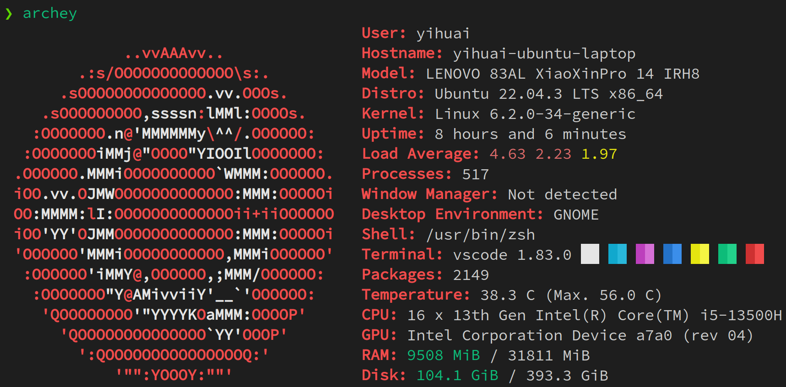
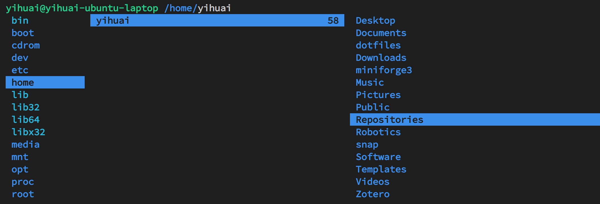
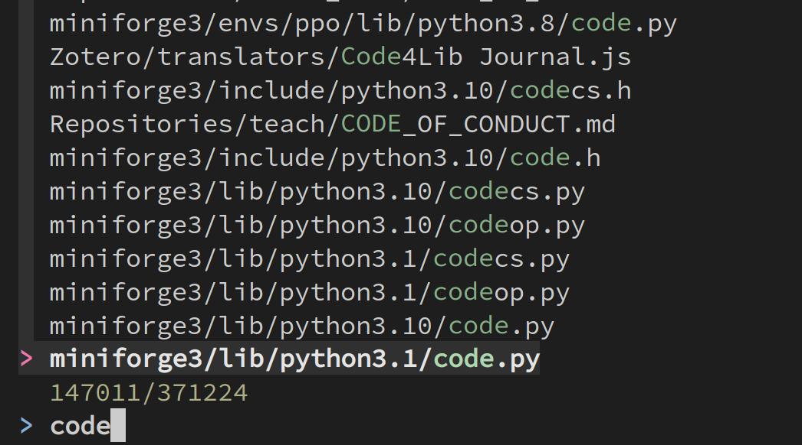

# One-shot configuration for Ubuntu systems

## Usage

This repository consists of the following three parts

### Install oh-my-zsh with basic plugins (without sudo)
```sh
./install_oh_my_zsh.sh
./config_oh_my_zsh.sh
```

Plugins include `zsh-autocomplete`, `zsh-autosuggestions`, `zsh-syntax-highlighting`, `powerlevel10k` (theme).

`zsh` will source `~/.zshrc` every time it starts. If you are using `bash` and would like to switch to `zsh`, 
please migrate your environment variables from `~/.bashrc` or `~/.bash_profile` to `~/.zshrc`. It is also recommended to copy `~/.bash_history` to `~/.zsh_history` so that the history commands can be autocompleted.

Use `source ~/.zshrc` to apply the changes, or you can also open a new `zsh` terminal.

### Install Nerd Fonts
If you have not installed nerd fonts, the icons may not display correctly. You can either use another theme without icons (e.g. `ZSH_THEME="simple"` in `~/.zshrc`) or install `SauceCodePro Nerd Font` with the ttf file provided in the repository. 

To install Nerd Fonts, double click the ttf file and follow the system instructions. After installation, set your terminal font either in GNOME (preference -> Profiles, usually the `Unnamed` profile -> Custom Font) or VSCode (search `Terminal Fonts` in settings) to `SauceCodePro Nerd Font`.

If you are using remote ssh to connect to a server and set up a zsh environment there, you should install the font in the **local machine** instead of the server! 

### Set up an ubuntu server from scratch (with sudo)

```sh
./setup_ubuntu.sh # this includes install_oh_my_zsh.sh and font installation
./config_oh_my_zsh.sh
```
This will install some necessary or useful packages for a brand-new ubuntu server/pc.

Some useful packages:
- [`archey`](https://github.com/HorlogeSkynet/archey4) is a system tool to display all system information (similar to `neofetch`, but easier to install). Install through `pip install archey4`; type `archey` in terminal to use.
    
- [`ranger`](https://github.com/ranger/ranger) is a vim-like file manager in terminal. Install through `pip install ranger-fm`; type `ranger` in terminal to use; check [ranger-cheetsheet](https://gist.github.com/heroheman/aba73e47443340c35526755ef79647eb) for hotkeys. 
    
- [`fzf`](https://github.com/junegunn/fzf) is a command line fuzzy finder. Install with `sudo apt-get install fzf` for all users or `git clone --depth 1 https://github.com/junegunn/fzf.git ~/.fzf && ~/.fzf/install` for current user without sudo; type `fzf` or customized hotkey to use.
    

### Install mamba for python virtual environments

```sh
./install_mamba.sh
```

Mamba is an alternative to conda with much faster create/install speed. (Use `mamba create/install` instead of `conda create/install`; other usages are all the same.)

Mambaforge is now the default version of [Miniforge](https://github.com/conda-forge/miniforge). 


## Docker test

To try out the environment, please use 
```sh
docker build -t zsh-test .
docker run -e "TERM=xterm-256color" -it zsh-test
```

If you are using `bash` before, you can mount your `./bash_history` to `./zsh_history` when running the container to have a look at the command autocompletion:
```sh
docker build -t zsh-test .
docker run -e "TERM=xterm-256color" --mount source=$HOME/.bash_history,target=/root/.zsh_history,type=bind -it zsh-test
``` 

